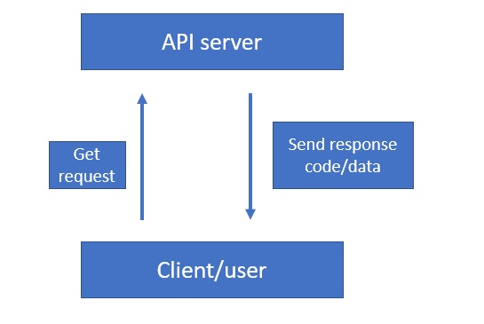
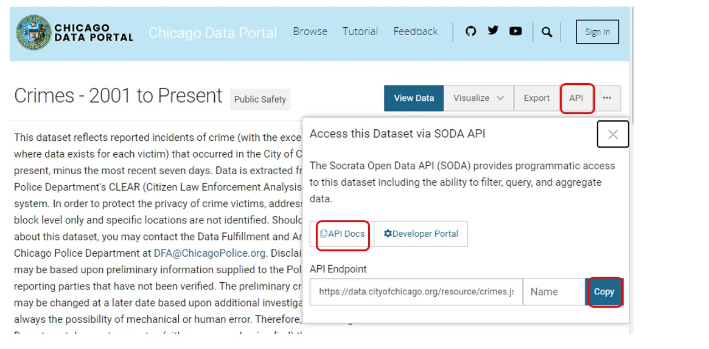
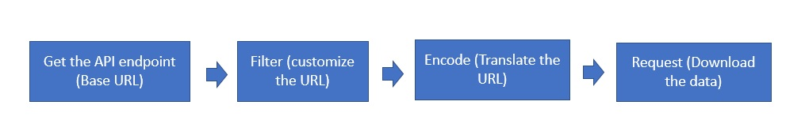
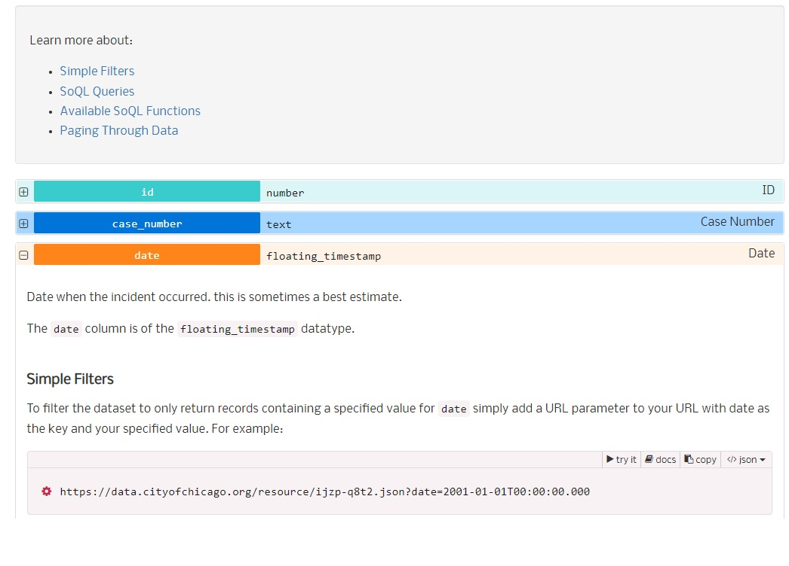

## Objectives
1. Access data from the Chicago data portal API.
2. Describe and set up the query parameters in a API call to get a subset of data using the API endpoint.
3. Define what are the response and request in a API data access call. 

## Overview 

In this tutorial, we will cover the basics and fundamentals of accessing data via API using the R programming language. 

Instead of downloading a dataset from the website and then loading them in R environment, we can request data directly from some certain websites through the application programming interface (API). This is one of the most commonly used method for data analysts and data scientists to get access to interesting data. 

API allows coding to interact with one another. Developers use APIs to build their website contents with certain features, instead of having to write code to scratch. Some websites like Facebook, Twitter and Google they provide their own API sites to allow users to get access to their contents and products. Here we will use web API to connect two different computers, the client and the server, and interact with each other to request data accordingly.


Typically and API includes these three core elements: 

1) **Access**: the user who is accessing the data or the service. 
2) **Request**: the data or the service being requested.
3) **Response**:the returned results of the request invocation from the server. 




## API, API endpoint and documentation

The [Chicago data portal](https://data.cityofchicago.org/) is a data warehouse hosts over 600 datasets in the easy-to-use format about City departments, services, facilities and performance. These data are available via a RESTful API called the Socrata Open Data API (SODA).


In this tutorial let's check out the [crimes dataset from 2001 to present (click **here**)](https://data.cityofchicago.org/Public-Safety/Crimes-2001-to-Present/ijzp-q8t2) from the Chicago data portal. We will need to write some R commands that create the request and tells the computer running the API. Then the computer will process the request, and return nicely-formatted data in the R environment.


A few terms we need to clarify before moving forward: 

1) **API**:an acronym for Application Programming Interface that software uses to access data, server software or other applications. 
2) **API endpoint**: a *UNIQUE* URL that represents an object or collection of objects/data.
3) **API documentation**: collection of references, tutorials, and examples demonstrate how to call the API and perform requests. 

From this Chicago data portal API, we need an API endpoint to proceed accessing the specific crimes dataset: the endpoints will allow us customize our request with parameters to call a specific resource or retrieve specific data. For each individual data record has its own unique endpoint (the unique URL with different endings). 


## Download data from Chicago data portal 

To get access to the API endpoint, you can click on the "API" button and then the API endpoint to copy the link. You can see the data is returned in a JSON format, which includes the crimes data from 2001 to present (~ 7M rows). The size of the data is too huge so we can use the API as a shortcut instead of downloading it as a .csv locally. 

At the same time, please check out the documentation: [API docs (click **here**)](https://dev.socrata.com/foundry/data.cityofchicago.org/ijzp-q8t2) to load the details of how to perform the requests. 

Please note, the format of the returned data or the response is often in the form of plain text files e.g JSON or .csv. JSON stands for JavaScript Object Notation, which is a lightweight format used for transmitting data in web applications. 





Below is the code sample to download the crimes dataset using the API endpoint. Please note you will need to install the packages first. 

In the code chunk below, we first set up the base URL using the API endpoint, then encode the URL into a proper format. Next we can retrieve the data using `fromJSON` function. 


```{r eval=F}
library(tidyverse)
library(rjson)
library(jsonlite)
library(RCurl)
# The base URL below is the API endpoint you copied from the page above. 
base_URL="https://data.cityofchicago.org/resource/crimes.json?"

# encodeURL allows you to translate the site into ascii values. 

full_URL=URLencode(base_URL)

# fromJSON function to import data as a data frame in R


crime_data <- fromJSON(full_URL)

```


Check out the returned dataset called crime_data. By default it only returns you the first 1000 records of the data. You can adjust the limit for the request. For example, we can set the limit as 300000 to get more records instead. 

```{r eval=F}
 
base_URL="https://data.cityofchicago.org/resource/crimes.json?"

# Adjust the limit. The paste0 function just concatenate two strings to update the URL. 

base_limit <- paste0(base_URL, "$limit=300000")

Crimes_limit <- URLencode(base_limit)

crime_data_update <- fromJSON(Crimes_limit)
```


## Data filtering

Most of the cases we just need a certain subset of the dataset. For example, how to download data from 2021 only? So we can update the process as the image below: 




How to request a certain subset of your data? We can customize the URL here. Note that you are using a new function - `paste0` - to paste together a complex URL string. Please check out the code chunk below: We first set the API endpoint as the base URL, and then append more strings to the end of the base URL to perform a certain query and data filtering. Next we can encode the URL and then download the data in R. 


For example, for the data filtering step, in order to return the dataset from 2021 only, we need to use the 'date' field to set the subset the records. The '`where`' parameter will filter the data by **rows**, and '`select`' parameter will return certain **columns** you are interested in only. The code below allows you to download data for 2021 only, with just 4 columns returned: data, primary type,  latitude and longitude. 

Please note the `date` column is of the floating_timestamp datatype. You can view more examples about the format filtering out each different columns from the API documentation page. 



```{r eval=F}
base_limit_2021 <- paste0(base_URL, "$limit=500000","&$where=date between '2020-12-31T23:59:00.000' and '2021-12-31T23:59:00.000'", "&$select=date, primary_type, latitude, longitude")
base_limit_2021_encode <- URLencode(base_limit_2021)
crime_2021 <- fromJSON(base_limit_2021_encode)
```


You can also use the API endpoint to quickly identify how many rows needs to be returned in a subset of data.The `count(...)` function is most commonly used with select function to return the count of a set of values.  For example, the commands below will calculate how many rows of records we have for crimes reported in 2021 only. It should return 207959. You can then set up the limit accordingly to get access to the subset. 

```{r eval=F}
base_limit_count <- paste0(base_URL, "$limit=300000","&$where=date between '2020-12-31T23:59:00.000' and '2021-12-31T23:59:00.000'","&$select=count(date)")

fromJSON(URLencode(base_limit_count))

base_limit_2021 <- paste0(base_URL, "$limit=210000","&$where=date between '2020-12-31T23:59:00.000' and '2021-12-31T23:59:00.000'", "&$select=date, primary_type, latitude, longitude")
base_limit_2021_encode <- URLencode(base_limit_2021)
crime_2021 <- fromJSON(base_limit_2021_encode)
```


## Bonus opportunity (20 points)

Can you use the API endpoint to get a subset of crimes data from the Chicago data portal, which only includes the data since 2021-01-01 to 2021-07-01 and the primary type is THEFT? Please only select these columns to be returned: date, primary_ type,arrest, latitude,and  longitude. Name the returned subset data as theft_2021.  Hint: you can use `&` inside the `paste0()` function to add additional filtering parameters. 

**Q1**: How many crimes occurred between 2021-01-01 to 2021-07-01 are theft? (5 points)

**Q2**: After retrieving this subset via the API request, use the `head()` function to return the first 6 records of the theft_2021 dataset. A screenshot of the first 6 records is needed as delivery (5 points)

**Q3**: Among all the theft records between 2021-01-01 to 2021-07-01, What percentage of crimes are solved (an arrest was made) by police? (10 points)


```{r eval=F, include=F}
base_theft_count <- paste0(base_URL, "$limit=900000","&$where=date between '2021-01-01T00:00:00.000' and '2021-06-30T23:59:59.000'","&primary_type='THEFT'", "&$select=count(date)")

fromJSON(URLencode(base_theft_count))


base_theft_2021 <- paste0(base_URL, "$limit=20000","&$where=date between '2021-01-01T00:00:00.000' and '2021-06-30T23:59:59.000'","&primary_type='THEFT'", "&$select=date, primary_type,arrest, latitude, longitude")
theft_2021 <- fromJSON(URLencode(base_theft_2021))


arrest <- theft_2021 %>% filter(arrest==TRUE)

```

