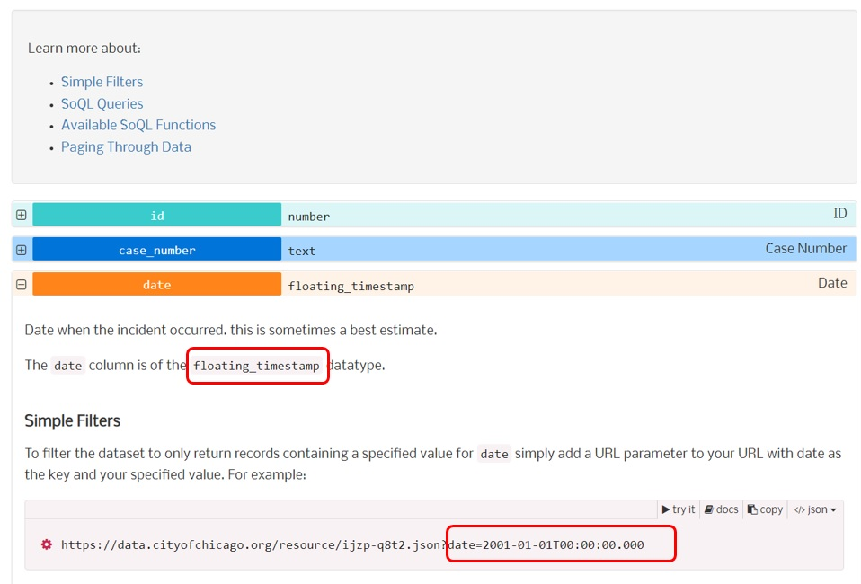

## Objectives
1. Access data from the Chicago data portal API.
2. Describe and set up the query parameters in a RESTful call to get a subset of data using the API endpoint.
3. Define response and request in a API data access call. 

## Overview 

Previously 

In this tutorial, we will cover the basics and fundamentals of accessing data via API using the R programming language. 

Instead of downloading a dataset from the website and then loading them in R environment, we can request data directly from some certain websites through the application programming interface (API). This is one of the most commonly used method for data analysts and data scientists to get access to interesting data. 

API allows coding to interact with one another. Developers use APIs to build their website contents with certain features, instead of having to write code to scratch. In this tutorial, we will use web API to connect two different computers, the client and the server, and interact with each other to request data accordingly. Some websites like Facebook, Twitter and Google they provide their own API sites to allow users to get access to their contents and products. 


Typically and API includes these three core elements: 

1) Access: the user who is accessing the data or the service. 
2) Request: The data or the service being requested.
3) Response:the returned results of the request invocation. 

The format of the returned data or the response is often in the form of plain text files e.g JSON or .csv. JSON stands for JavaScript Object Notation, which is a lightweight format used for transmitting data in web applications. 


## Chicago Open Data Portal

The [Chicago data portal](https://data.cityofchicago.org/) is a data warehouse hosts over 600 datasets in the easy-to-use format about City departments, services, facilities and performance. These data are available via a RESTful API called the Socrata Open Data API (SODA).

So the API is the way for an application to request a service or data from another application. The API allows users and developers to avoid rebuilding application features that already exists. We need an API endpoint to proceed: the place where those request are fulfilled. So the API endpoint is a unique URL which represents an object or collection of objects/data. For each of the Socrata dataset and each individual data record has its own unique endpoint. This is what you will point your HTTP client at to interact with the data resources. All the datasets have this unique identifier (usually 8 alphanumeric characters) split into four and four by a dash. 

You can use the API endpoint to locate the dataset. In this tutorial let's check out the [crimes dataset from 2001 to present](https://data.cityofchicago.org/Public-Safety/Crimes-2001-to-Present/ijzp-q8t2) from the Chicago data portal. 

To get access to the API endpoint, you can click on the "API" button and then the API endpoint to copy the link. You can see the data is returned in a JSON format, which includes the crimes data from 2001 to present (~ 7M rows). The size of the data is too huge so we can use the API as a shortcut instead of downloading it as a .csv locally. In addition, you can also click on the [API docs](https://dev.socrata.com/foundry/data.cityofchicago.org/ijzp-q8t2) to load the detailed documentation (with inline runable examples of R commands) of this API endpoint for the crimes data. 


Below is the code sample to download the crimes dataset using the API endpoint. 

```{r eval=F}
library(dplyr)
library(rjson)
library(jsonlite)
library(RCurl)
# The base URL below is the one you get from the API endpoint. 
base_URL="https://data.cityofchicago.org/resource/crimes.json"

# encodeURL allows you to translate the site into asii values. 

full_URL=URLencode(base_URL)

# fromJSON function to import data as a data frame in R


crime_data <- fromJSON(full_URL)

```


Check out the returned dataset called crime_data. By default it only returns you the first 1000 records of the data. You can adjust the limit for the request.For example, we can set the limit as 300000 to get the 300000 records instead. 

```{r eval=F}
# The base URL below is the one you get from the API endpoint. 
base_URL="https://data.cityofchicago.org/resource/crimes.json?"

# Adjust the limit. The paste0 function just concatenate two strings.

base_limit <- paste0(base_3, "$limit=300000")

# encodeURL allows you to translate the site into asii values. 

Crimes_limit <- URLencode(base_limit)

# fromJSON function to import data as a data frame in R


crime_data_update <- fromJSON(Crimes_limit)
```

Note that you are using a new function - paste0 - to paste together a complex URL string. We set the API endpoint as the base URL, and create a more complex URL string to extract a subset of the data. For example, to return the dataset from 2022 only, we need to use the 'date' field to set the subset the records. The 'where' parameter will subset the data by rows, and 'select' parameter will help to return some certain fields only. The example below allows you to download data fo 2022 only, with only 4 fields returned: data, primary type, and coordinates. 

Please note the date column is of the floating_timestamp datatype. You can view more examples about the format filtering out each different columns from the API documentation page. 



```{r eval=F}
base_limit_2022 <- paste0(base_URL, "$limit=300000","&$where=date between '2021-12-31T23:59:00.000' and '2022-11-20T23:59:00.000'", "&$select=date, primary_type, x_coordinate, y_coordinate")
base_limit_2022_encode <- URLencode(base_limit_2022)
crime_2022 <- fromJSON(base_limit_2022_encode)
```

You can also use the API endpoint to quickly identify how many rows needs to be returned in order to set up the limit parameter. For example, the commands below will summaries how many rows are there for the crimes in 2022. It should return 204995. You can then set up the limit accordingly to get access to the subset. 

```{r eval=F}
base_limit_count <- paste0(base_URL, "$limit=300000","&$where=date between '2021-12-31T23:59:00.000' and '2022-11-20T23:59:00.000'","&$select=count(date)")
fromJSON(URLencode(base_limit_count))

base_limit_2022 <- paste0(base_URL, "$limit=204995","&$where=date between '2021-12-31T23:59:00.000' and '2022-11-20T23:59:00.000'", "&$select=date, primary_type, x_coordinate, y_coordinate")
base_limit_2022_encode <- URLencode(base_limit_2022)
crime_2022 <- fromJSON(base_limit_2022_encode)
```


## Bonus opportunity (10 points)

Can you use the API endpoint to get a subset of crimes data from the Chicago data portal, which only includes the data since 2022-01-01 and the primary type is THEFT? 
