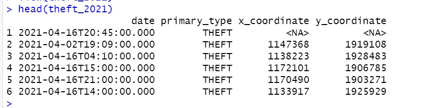

```{r, echo = F}
library(knitr)
opts_chunk$set(tidy.opts=list(width.cutoff=80),tidy=TRUE)
```

## Bonus opportunity (10 points)

Can you use the API endpoint to get a subset of crimes data from the Chicago data portal, which only includes the data since 2021-01-01 to 2021-07-01 and the primary type is THEFT? Please only select these columns to be returned: date, primary_ type, x-coordinate and y-coordinate. Name the returned subset data as theft_2021.  Hint: you can use `&` inside the `paste0()` function to add additional filtering parameters. 

**Q1**: How many crimes occurred between 2021-01-01 to 2021-07-01 are theft? (5 points)


Answer:  17091


**Q2**: After retrieving this subset via the API request, use the head() function to return the first 6 records of the theft_2021 dataset. A screenshot of the first 6 records is needed as delivery (5 points)

Answer: 




```{r warning=F, message=F}
library(tidyverse)
library(rjson)
library(jsonlite)
library(RCurl)
# The base URL below is the API endpoint you copied from the page above. 

base_URL="https://data.cityofchicago.org/resource/crimes.json?"

base_theft_count <- paste0(base_URL, "$limit=900000",
"&$where=date between '2021-01-01T00:00:00.000' 
    and '2021-06-30T23:59:59.000'",
    "&primary_type='THEFT'", "&$select=count(date)")

fromJSON(URLencode(base_theft_count))


base_theft_2021 <- paste0(base_URL, "$limit=20000",
"&$where=date between '2021-01-01T00:00:00.000' and
    '2021-06-30T23:59:59.000'",
    "&primary_type='THEFT'", "&$select=date, 
    primary_type, x_coordinate, y_coordinate")
theft_2021 <- fromJSON(URLencode(base_theft_2021))
head(theft_2021)

```

